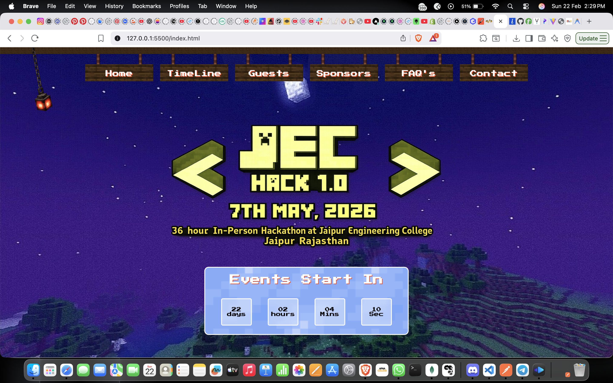

# 🟨 JEC Hack 1.0 – Minecraft-Themed Hackathon Website 🎉



**Live Site:** https://jechack-1-0.onrender.com

A fully immersive Minecraft-inspired hackathon website built to showcase tracks, sponsors, stats, events, and prizes in a pixel-perfect game-style UI.

---

## 📌 Overview

**JEC Hack 1.0** is a 36-hour in-person innovation marathon web experience with:

🎮 Minecraft-style voxel UI  
🧠 Interactive sections  
🚂 Track displays  
🏆 Prize pool visuals  
🛠 Hackathon journey storytelling

The site is designed for both event participants and organizers to explore highlights, sponsors, tracks, and event features.

---

## 🚀 Live Demo

👉 https://jechack-1-0.onrender.com

Check out the full design, animations, and interactive elements live in your browser!

---

## 🛠 Features

✔ Minecraft-inspired pixel UI  
✔ Responsive layout  
✔ Animated counters & stats  
✔ Multiple sections:
   - Hero Banner
   - About Section
   - Stats Highlights
   - Hackathon Tracks
   - Sponsor Showcase
   - Why Attend
   - Prize Pool
   - Footer
✔ Custom game-style assets  
✔ SEO-ready headers

---

## 🧱 Tech Stack

| Layer | Technology |
|-------|------------|
| Frontend | HTML5 |
| Styling | CSS3 / SCSS |
| Interaction | Vanilla JavaScript |
| Deployment | Render |
| Assets | Pixel / Voxel UI designs |

---

## 📂 Repository Structure
MncrftHack/
│
├── index.html
├── style.css
├── script.js
├── sponser.html
├── assets/
│ ├── images/
│ ├── logos/
│ └── textures/
├── fonts/
├── README.md


---

## 📦 Installation & Local Setup

No external dependencies — pure frontend!

1. **Clone the repository**
```bash
git clone https://github.com/chetankumawat13/MncrftHack.git

cd MncrftHack